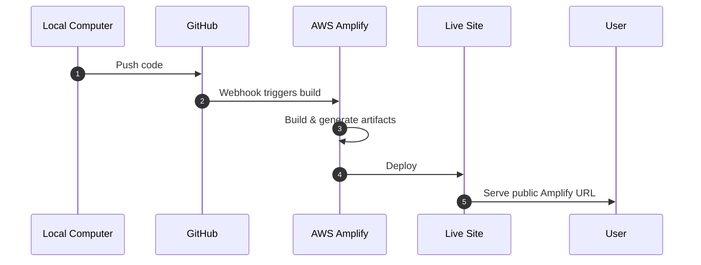

# My computer to browser diagram

```mermaid
sequenceDiagram
    autonumber

    participant Local as Local Computer
    participant GitHub as GitHub
    participant Amplify as AWS Amplify
    participant Site as Live Site
    participant User as User

    Local->>GitHub: Push code
    GitHub->>Amplify: Webhook triggers build
    Amplify->>Amplify: Build & generate artifacts
    Amplify->>Site: Deploy
    Site->>User: Serve public Amplify URL
```

